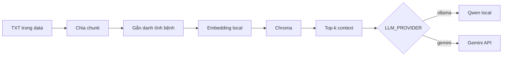

# RAG bệnh cây với LangChain

Module này đọc tài liệu `.txt`, tạo embedding tiếng Việt trên máy, lưu vector
trong Chroma và dùng LLM để sinh câu trả lời có trích nguồn. LLM mặc định là
`qwen3.5:9b` chạy local qua Ollama; Gemini vẫn được giữ làm provider tùy chọn.

## Luồng xử lý



- `index`: đọc `data/**/*.txt`, chia chunk và build lại `chroma_db/`.
- `search`: kiểm tra các chunk được truy xuất, không gọi LLM.
- `ask`: retrieve context rồi gọi provider được chọn trong `.env`.

Nếu câu hỏi gọi đúng tên một bệnh duy nhất, retrieval sẽ lọc theo bệnh đó.
Câu hỏi chung hoặc câu hỏi so sánh nhiều bệnh sẽ tìm trên toàn collection.

## 1. Cài Ollama trên Windows

Cài bằng `winget`:

```powershell
winget install --exact --id Ollama.Ollama
```

Hoặc tải trình cài đặt từ [ollama.com/download/windows](https://ollama.com/download/windows).
Sau khi cài, mở terminal PowerShell mới rồi kiểm tra:

```powershell
ollama --version
```

Ứng dụng Ollama trên Windows thường tự chạy server nền. Nếu
`http://127.0.0.1:11434` chưa hoạt động, mở ứng dụng Ollama hoặc chạy:

```powershell
ollama serve
```

Giữ terminal này mở nếu bạn chạy `ollama serve` thủ công.

## 2. Tải và thử model local

Model mặc định, phù hợp với luồng RAG tiếng Việt:

```powershell
ollama pull qwen3.5:9b
ollama run qwen3.5:9b
```

Nhập một câu hỏi để kiểm tra. Gõ `/bye` để thoát phiên chat. Có thể xem model
đã tải và model đang nằm trong bộ nhớ bằng:

```powershell
ollama list
ollama ps
```

`qwen3.5:9b` chiếm khoảng 6.6 GB ở bản Ollama mặc định. Cấu hình repo giới hạn
context ở 8192 token để phù hợp RTX 3070 Ti Laptop 8 GB. Nếu máy thiếu bộ nhớ
hoặc cần phản hồi nhanh hơn, dùng model 4B:

```powershell
ollama pull qwen3.5:4b
```

Sau đó đổi `OLLAMA_MODEL=qwen3.5:4b` trong `.env`.

## 3. Tạo môi trường Python

Yêu cầu Python 3.11. Từ thư mục gốc repository:

```powershell
Set-Location RAG-module-2
py -3.11 -m venv .venv
.\.venv\Scripts\Activate.ps1
python -m pip install --upgrade pip
python -m pip install -r requirements.txt
```

Nếu PowerShell chặn script activate, chỉ áp dụng cho terminal hiện tại:

```powershell
Set-ExecutionPolicy -Scope Process -ExecutionPolicy Bypass
.\.venv\Scripts\Activate.ps1
```

Tạo `.env` nếu file chưa tồn tại:

```powershell
if (-not (Test-Path .env)) { Copy-Item .env.example .env }
```

## 4. Cấu hình Ollama

Nội dung cần có trong `.env`:

```dotenv
LLM_PROVIDER=ollama

OLLAMA_MODEL=qwen3.5:9b
OLLAMA_BASE_URL=http://127.0.0.1:11434
OLLAMA_NUM_CTX=8192
OLLAMA_NUM_PREDICT=800
OLLAMA_KEEP_ALIVE=10m
OLLAMA_THINK=false

EMBEDDING_MODEL=AITeamVN/Vietnamese_Embedding
EMBEDDING_DEVICE=cpu
```

Ý nghĩa các biến Ollama:

| Biến | Mặc định | Mục đích |
| --- | --- | --- |
| `OLLAMA_MODEL` | `qwen3.5:9b` | Tên model đã tải bằng `ollama pull` |
| `OLLAMA_BASE_URL` | `http://127.0.0.1:11434` | Địa chỉ Ollama server |
| `OLLAMA_NUM_CTX` | `8192` | Số token context tối đa |
| `OLLAMA_NUM_PREDICT` | `800` | Số token đầu ra tối đa |
| `OLLAMA_KEEP_ALIVE` | `10m` | Thời gian giữ model trong bộ nhớ sau request |
| `OLLAMA_THINK` | `false` | Bật/tắt reasoning; nên tắt cho RAG thông thường |

Embedding để ở CPU nhằm dành VRAM cho LLM. Lần chạy `index` đầu tiên sẽ tải
`AITeamVN/Vietnamese_Embedding`, nên cần Internet và có thể mất vài phút.

## 5. Chạy RAG

Vẫn ở thư mục `RAG-module-2` và đã activate `.venv`:

```powershell
python main.py index
python main.py search "Bệnh ghẻ táo có triệu chứng gì?"
python main.py ask "Cách quản lý bệnh thối đen trên táo?"
```

Thay đổi số chunk truy xuất:

```powershell
python main.py search "So sánh bệnh ghẻ và thối đen trên táo" --top-k 6
python main.py ask "So sánh bệnh ghẻ và thối đen trên táo" --top-k 6
```

Các lệnh chính:

| Lệnh | Tác dụng | Cần Ollama/Gemini |
| --- | --- | --- |
| `python main.py index` | Build lại index từ `data/**/*.txt` | Không |
| `python main.py search "<câu hỏi>"` | In các chunk gần nhất | Không |
| `python main.py ask "<câu hỏi>"` | Sinh câu trả lời và in nguồn | Có |

Chạy lại `index` khi thêm/sửa tài liệu hoặc đổi embedding model. Đổi LLM,
context, prompt hay provider không yêu cầu build lại index.

## Dùng Gemini thay Ollama

Đổi `.env` thành:

```dotenv
LLM_PROVIDER=gemini
GEMINI_API_KEY=your_gemini_api_key
GEMINI_MODEL=gemini-2.5-flash
```

`index` và `search` vẫn hoàn toàn local. Khi dùng Gemini, chỉ câu hỏi và các
chunk đã retrieve được gửi tới API; toàn bộ corpus không được gửi đi.

## Chạy test

Test không gọi Ollama, Gemini hay tải embedding model thật:

```powershell
python -m pytest -q
```

## Xử lý lỗi thường gặp

### Không nhận lệnh `ollama`

Mở PowerShell mới sau khi cài. Nếu vẫn lỗi, mở ứng dụng Ollama từ Start Menu
và kiểm tra lại `ollama --version`.

### Không kết nối được `127.0.0.1:11434`

Ollama server chưa chạy. Mở ứng dụng Ollama hoặc chạy `ollama serve` trong một
terminal khác, sau đó thử:

```powershell
ollama list
```

### Báo không tìm thấy model

Tên trong `.env` phải trùng với kết quả `ollama list`:

```powershell
ollama pull qwen3.5:9b
ollama list
```

### Chậm, tràn VRAM hoặc chạy một phần trên CPU

Giảm context trước:

```dotenv
OLLAMA_NUM_CTX=4096
```

Nếu vẫn thiếu bộ nhớ, chuyển sang `qwen3.5:4b`. Không nên chạy đồng thời
model-service YOLO của `detection-module` và Qwen 9B trên GPU 8 GB. Dùng
`ollama ps` để xem model đang chạy trên GPU hay CPU.

### Câu trả lời hết giữa chừng

Tăng `OLLAMA_NUM_PREDICT`, ví dụ `1200`. Giá trị lớn hơn làm thời gian sinh câu
trả lời lâu hơn và có thể tăng mức dùng bộ nhớ.

### Muốn thử DeepSeek reasoning

```powershell
ollama pull deepseek-r1:8b
```

Sau đó cấu hình:

```dotenv
OLLAMA_MODEL=deepseek-r1:8b
OLLAMA_THINK=true
```

Model reasoning thường chậm hơn. Với hỏi đáp dựa trên context, nên bắt đầu bằng
Qwen và `OLLAMA_THINK=false`.

## Dùng trực tiếp từ Python

```python
from rag import ask, build_index, retrieve

document_count, chunk_count = build_index()
print(f"Đã index {document_count} tài liệu thành {chunk_count} chunk")

chunks = retrieve("Dấu hiệu bệnh ghẻ táo là gì?")
for chunk in chunks:
    print(chunk.metadata["source"], chunk.metadata["disease"])

answer, sources = ask("Cách quản lý bệnh thối đen trên táo?")
print(answer)
print(sources)
```

## Cấu trúc chính

```text
RAG-module-2/
|-- config.py          # Embedding và factory Ollama/Gemini
|-- rag.py             # Pipeline index, retrieve, ask
|-- main.py            # CLI
|-- data/              # Corpus TXT
|-- chroma_db/         # Vector database được sinh local
|-- docs/              # Tài liệu kỹ thuật chi tiết
|-- tests/             # Test offline
|-- .env.example
`-- requirements.txt
```
