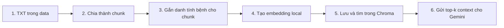

# RAG LangChain tối giản

Đây là phiên bản RAG nhỏ, dễ đọc để bắt đầu với LangChain. Hệ thống đọc tài liệu `.txt`, tạo embedding ngay trên máy, lưu vector vào Chroma và chỉ dùng Gemini ở bước sinh câu trả lời.

Tiếng Việt là luồng sử dụng chính. Câu hỏi tiếng Anh vẫn có thể hoạt động, nhưng chất lượng truy xuất không phải tiêu chí bắt buộc của phiên bản này vì model embedding được tối ưu cho tiếng Việt.

## RAG hoạt động như thế nào?



Có hai giai đoạn độc lập:

- **Index:** đọc tài liệu, chia chunk, thêm identity header gồm tài liệu/bệnh/tên gọi, tạo embedding và lưu vào `chroma_db/`.
- **Hỏi đáp:** nếu câu hỏi khớp duy nhất một bệnh đã biết thì chỉ tìm trong các chunk của bệnh đó; câu hỏi chung hoặc nhắc nhiều bệnh vẫn tìm toàn collection. Gemini sau đó trả lời dựa trên các chunk được chọn.

Toàn bộ corpus và vector nằm trên máy. Khi chạy `ask`, chỉ câu hỏi và các chunk được truy xuất mới được gửi tới Gemini.

## Quick start trên PowerShell

Yêu cầu Python 3.11. Từ thư mục `RAG-module-2`:

```powershell
py -3.11 -m venv .venv
.\.venv\Scripts\Activate.ps1
python -m pip install -r requirements.txt
Copy-Item .env.example .env
```

Mở `.env`, điền khóa Gemini:

```dotenv
GEMINI_API_KEY=your_gemini_api_key
```

Sau đó chạy ba lệnh chính:

```powershell
python main.py index
python main.py search "Bệnh ghẻ táo có triệu chứng gì?"
python main.py ask "Cách quản lý bệnh thối đen trên táo?"
```

Lần tạo index đầu tiên sẽ tải `AITeamVN/Vietnamese_Embedding`, vì vậy có thể mất nhiều thời gian và cần vài GB dung lượng cache. `index` và `search` không cần Gemini API key; chỉ `ask` cần khóa này.

## Các lệnh CLI

| Lệnh                                | Mục đích                                                | Gọi Gemini? |
| ----------------------------------- | ------------------------------------------------------- | ----------- |
| `python main.py index`              | Xóa collection cũ và build lại index từ `data/**/*.txt` | Không       |
| `python main.py search "<câu hỏi>"` | In các chunk gần nhất để kiểm tra retrieval             | Không       |
| `python main.py ask "<câu hỏi>"`    | Retrieval rồi sinh câu trả lời kèm danh sách nguồn      | Có          |

Mỗi lần thêm hoặc sửa tài liệu, chạy lại `python main.py index`. Nên chạy `search` trước `ask`: nếu nguồn truy xuất chưa đúng thì Gemini cũng không có context đúng để trả lời.

Index được tạo bởi phiên bản cũ không có identity metadata. Sau khi cập nhật source, bắt buộc chạy lại `python main.py index` trước khi `search` hoặc `ask`.

## Dùng trực tiếp từ Python

```python
from rag import ask, build_index, retrieve

document_count, chunk_count = build_index()
print(f"Đã index {document_count} tài liệu thành {chunk_count} chunk")

chunks = retrieve("Dấu hiệu bệnh ghẻ táo là gì?")
for chunk in chunks:
    print(chunk.metadata["source"], chunk.metadata["disease"])

answer, sources = ask("Cách quản lý bệnh thối đen trên táo?")
print(answer)
print(sources)
```

## Cấu trúc dự án

```text
RAG-module-2/
├── config.py          # Cấu hình và factory cho embedding/Gemini
├── rag.py             # Toàn bộ pipeline index, retrieve, ask
├── main.py            # CLI index/search/ask
├── data/              # Tài liệu TXT do bạn quản lý
├── docs/              # Tài liệu kỹ thuật và vận hành
├── tests/             # Test không gọi model thật hoặc Internet
├── .env.example
└── requirements.txt
```
