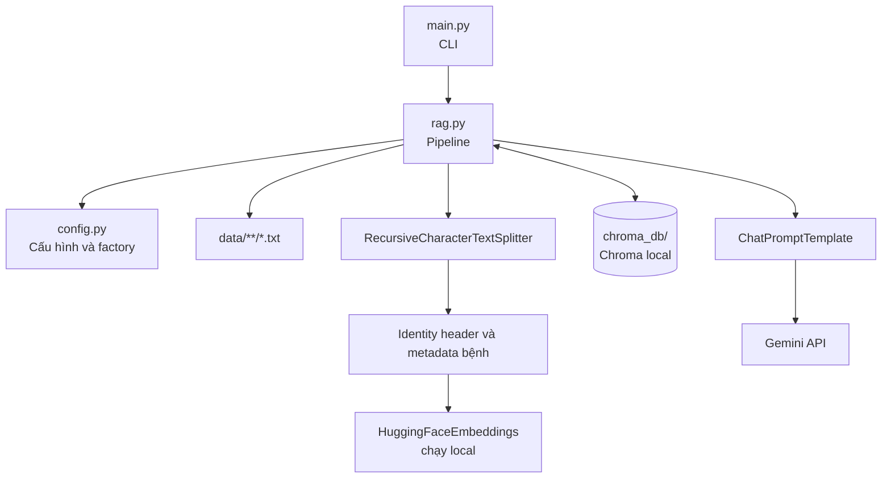
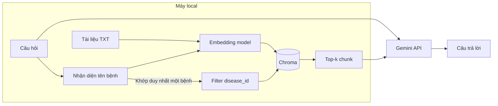

# Kiến trúc hệ thống

[← README](../README.md) · [Pipeline](PIPELINE.md) · [Các thành phần](COMPONENTS.md)

## Mục tiêu thiết kế

Kiến trúc V1 ưu tiên ít thành phần và luồng gọi một chiều. Mỗi bước có thể kiểm tra riêng: kiểm tra tài liệu, build index, kiểm tra retrieval rồi mới gọi LLM.

Dependency chỉ đi từ `main.py` xuống `rag.py` và `config.py`. CLI không tự xử lý dữ liệu, còn `config.py` không chứa logic retrieval.

## Trách nhiệm của source chính

| File | Trách nhiệm |
|---|---|
| `config.py` | Đọc `.env`, giữ đường dẫn/hằng số, tạo embedding model và chat model |
| `rag.py` | Load TXT, tạo danh tính bệnh cho chunk, build Chroma, filter/retrieve, format context và hỏi Gemini |
| `main.py` | Parse `index`, `search`, `ask`; in kết quả và lỗi thân thiện |

Ba file trên là source chính. `data/` là đầu vào, `chroma_db/` là sản phẩm có thể tạo lại, còn `tests/` xác nhận hành vi mà không gọi mạng.

## Ranh giới local và cloud

Các dữ liệu luôn ở local:

- Toàn bộ thư mục `data/`.
- Model `AITeamVN/Vietnamese_Embedding` sau khi tải về cache.
- Vector, identity header, nội dung chunk và metadata bệnh trong `chroma_db/`.
- Quá trình `index` và `search`.

Khi chạy `ask`, Gemini nhận:

- Câu hỏi người dùng.
- Prompt hệ thống.
- K chunk đã truy xuất, mặc định `TOP_K=4`; CLI có thể ghi đè bằng `--top-k`.

Gemini không được gửi toàn bộ corpus. Tuy vậy, không nên đặt thông tin bí mật vào tài liệu nếu chính sách sử dụng dịch vụ Gemini của dự án chưa cho phép gửi các đoạn được truy xuất.

## Hai chế độ retrieval

- **Khớp duy nhất một bệnh:** tên chính hoặc tên gọi khác được quy về một `disease_id`; Chroma similarity search nhận filter theo ID đó. Ví dụ, câu hỏi chỉ về bệnh ghẻ táo không cạnh tranh với chunk của bệnh thối đen.
- **Không rõ hoặc nhắc nhiều bệnh:** không áp filter và dense search trên toàn collection. Nhờ vậy câu hỏi chỉ mô tả triệu chứng và câu hỏi so sánh nhiều bệnh không bị loại mất tài liệu cần thiết.

Trước khi embedding, mọi chunk được thêm identity header gồm `Tài liệu`, `Bệnh` và `Tên gọi`. Vì vậy một chunk chỉ nói về triệu chứng vẫn mang danh tính bệnh. Header do pipeline tạo tự động; người viết dữ liệu không lặp header trong từng đoạn.

## Vì sao tách embedding và LLM?

Embedding làm nhiệm vụ tìm kiếm; LLM làm nhiệm vụ diễn đạt câu trả lời. V1 dùng embedding local và Gemini, nên:

- Đổi Gemini sang local LLM chỉ cần thay factory `create_chat_model()`; không phải build lại index.
- Đổi `EMBEDDING_MODEL`, cách normalize vector hoặc loại embedding thì phải chạy lại `python main.py index`.
- Đổi `GEMINI_MODEL` hoặc prompt không làm thay đổi vector đã lưu.

## Điểm mở rộng sau V1

- **Local LLM:** thay phần cài đặt `create_chat_model()` bằng một LangChain chat model tương thích, ví dụ Ollama.
- **FastAPI:** gọi các hàm public trong `rag.py`; không đưa logic RAG vào route handler.
- **Detection:** đưa tên bệnh dự đoán vào câu hỏi để dùng lại cơ chế nhận diện và filter `disease_id`; vẫn giữ RAG là module độc lập.

Các điểm mở rộng này chưa được triển khai. V1 cũng chưa có session memory, hybrid search, reranker, OCR hoặc ingestion theo thời gian thực.

Xem luồng chi tiết tại [PIPELINE.md](PIPELINE.md), API cụ thể tại [COMPONENTS.md](COMPONENTS.md).
