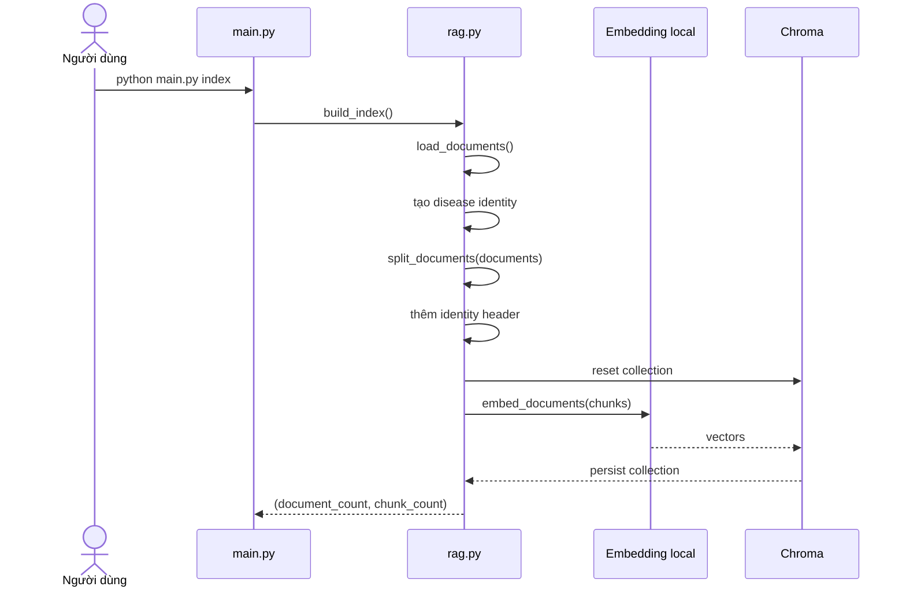
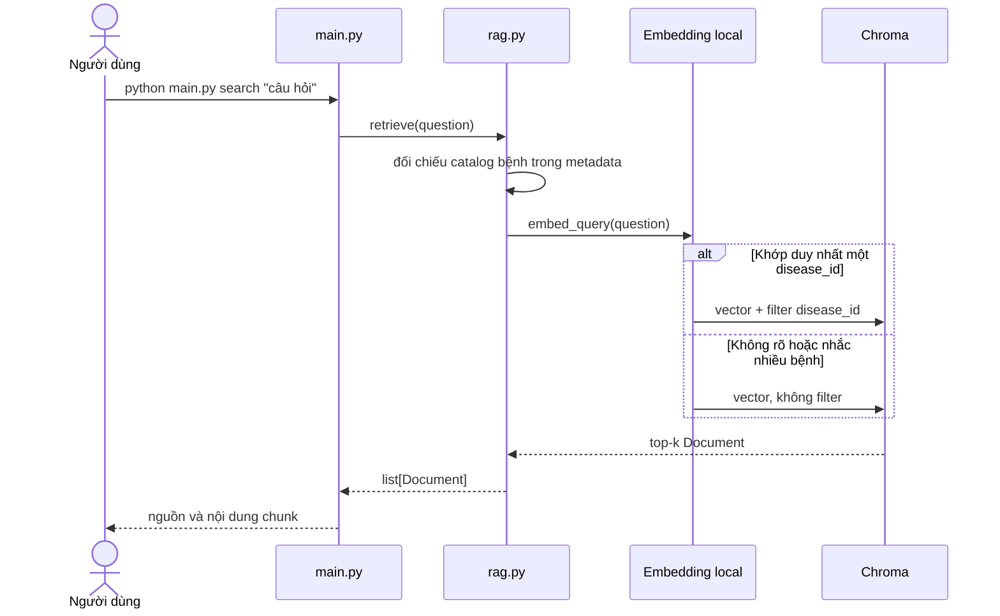
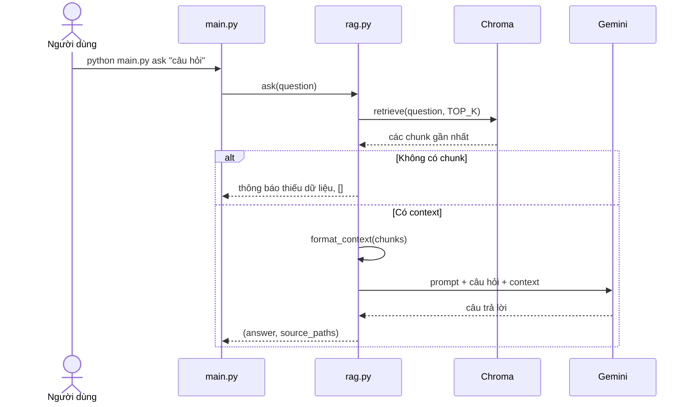

# Pipeline kỹ thuật

[← README](../README.md) · [Kiến trúc](ARCHITECTURE.md) · [Workflow](WORKFLOW.md)

## 1. Pipeline tạo index

```text
data/**/*.txt
    → load UTF-8 thành Document
    → tạo disease identity và metadata
    → chia bằng RecursiveCharacterTextSplitter
    → thêm identity header vào từng chunk
    → tạo vector bằng AITeamVN/Vietnamese_Embedding
    → lưu chunk + vector + metadata vào Chroma
```

`python main.py index` luôn build lại toàn bộ collection. Cách này đơn giản, tránh chunk trùng và không cần manifest/fingerprint cho tập dữ liệu nhỏ.



Các bước chính:

1. Tìm đệ quy mọi file `.txt` bên dưới `data/`.
2. Đọc từng file bằng UTF-8 và bỏ qua file rỗng.
3. Tạo một `Document` cùng metadata nguồn và danh tính bệnh.
4. Chia nội dung với `CHUNK_SIZE=1000`, `CHUNK_OVERLAP=150`.
5. Thêm header `Tài liệu` / `Bệnh` / `Tên gọi` vào đầu mỗi chunk trước khi embedding.
6. Xóa đúng collection của ứng dụng, sau đó tạo embedding và ghi lại các chunk.

Nếu thay đổi tài liệu, chunk size, overlap hoặc embedding model, phải chạy lại lệnh `index`.

Thay đổi identity header/metadata cũng đổi dữ liệu được embedding. Vì vậy index tạo bởi phiên bản cũ bắt buộc phải được build lại, không được dùng tiếp.

Để giữ source đơn giản, collection cũ được reset trước khi ghi các chunk mới. Nếu
model hết bộ nhớ hoặc quá trình ghi index thất bại giữa chừng, collection có thể
rỗng; sửa nguyên nhân rồi chạy lại `python main.py index`.

## 2. Pipeline `search`

`search` dùng để quan sát retrieval mà không gọi Gemini:



`retrieve(question, k=TOP_K)` đọc catalog bệnh từ metadata đang có trong Chroma rồi đối chiếu câu hỏi với `disease` và các tên trong `disease_aliases`.

- Nếu chỉ một `disease_id` khớp, similarity search dùng Chroma filter theo ID đó.
- Nếu không có khớp rõ ràng hoặc câu hỏi nhắc nhiều bệnh, similarity search không filter và tìm toàn corpus.

Matcher bỏ khác biệt hoa/thường và dấu tiếng Việt, đồng thời cho phép các từ cấu trúc “bệnh”, “trên”, “cây” chen trong tên. Phần có nghĩa của alias vẫn phải nằm thành một cụm liên tiếp; các cụm bị phủ định bằng “không phải”, “loại trừ”, “not” hoặc “exclude” không được dùng để bật filter.

V1 không rewrite câu hỏi, BM25 hay rerank. Cơ chế filter chỉ thu hẹp phạm vi; thứ tự các chunk trong phạm vi vẫn do dense similarity quyết định.

## 3. Pipeline `ask`



Mỗi chunk trong prompt có nhãn rõ ràng:

```text
[Nguồn 1: apple/apple_scab.txt]
Tài liệu: Apple Scab
Bệnh: Bệnh ghẻ táo
Tên gọi: bệnh ghẻ táo | apple scab | bệnh sẹo táo
<nội dung chunk>
```

Prompt yêu cầu Gemini:

- Chỉ trả lời bằng context được cung cấp.
- Nói rõ khi context chưa đủ.
- Không tự tạo hoạt chất, liều lượng hoặc khuyến nghị hóa chất.
- Trả lời theo ngôn ngữ câu hỏi; mặc định dùng tiếng Việt.
- Dẫn nhãn `[Nguồn n]` cho thông tin đã sử dụng.

`ask()` đồng thời trả một danh sách đường dẫn nguồn lấy trực tiếp từ metadata. Danh sách này phản ánh retrieval thực tế và không phụ thuộc việc LLM có viết citation đúng hay không.

## Identity header và metadata

Mỗi tài liệu giữ metadata nguồn và danh tính bệnh; splitter bổ sung `start_index` cho từng chunk:

| Trường | Ví dụ | Mục đích |
|---|---|---|
| `source` | `apple/apple_scab.txt` | Citation và truy vết về file gốc |
| `crop` | `apple` | Nhận biết nhóm cây trồng |
| `title` | `Apple Scab` | Tên dễ đọc suy ra từ filename |
| `disease` | `Bệnh ghẻ táo` | Tên bệnh chuẩn để hiển thị |
| `disease_id` | `apple-ghe-tao` | ID chuẩn hóa ổn định dùng cho Chroma filter |
| `disease_aliases` | `bệnh ghẻ táo \| apple scab \| bệnh sẹo táo` | Chuỗi tên chuẩn và tên gọi khác dùng để nhận diện query |
| `start_index` | `0`, `850`, ... | Vị trí ký tự bắt đầu của chunk trong tài liệu gốc |

`disease_aliases` dùng ` | ` làm dấu phân cách nội bộ; một alias không được chứa ký tự `|`. Splitter sao chép metadata từ `Document` gốc sang từng chunk rồi pipeline thêm identity header vào `page_content` trước khi embedding. Vì header được thêm sau bước chia, `page_content` lưu trong Chroma có thể dài hơn `CHUNK_SIZE`; `start_index` vẫn chỉ vị trí của nội dung gốc trong file.

`ask()` dùng đúng các chunk đã qua identity header làm context. Cơ chế nhận diện/filter của `ask` giống `search` vì cả hai đều gọi `retrieve()`.

Dense search chưa có relevance threshold đã được hiệu chỉnh. Với collection không
rỗng, một câu ngoài corpus vẫn có thể nhận các chunk "gần nhất"; prompt chịu trách
nhiệm nói rằng context chưa đủ. Đây là giới hạn có chủ đích của baseline V1.

## Luồng lỗi

| Tình huống | Dừng ở đâu | Cách xử lý |
|---|---|---|
| Không có TXT hợp lệ | `load_documents()` | Thêm file vào `data/<crop>/` rồi chạy lại `index` |
| File không phải UTF-8 | `load_documents()` | Lỗi nêu đúng file; lưu lại file bằng UTF-8 |
| Chưa có index | `retrieve()` / `ask()` | Chạy `python main.py index` |
| Câu hỏi rỗng | `retrieve()` / `ask()` | Nhập câu hỏi có nội dung |
| Retrieval không có chunk | `ask()` | Trả thông báo thiếu dữ liệu, không gọi Gemini |
| Thiếu `GEMINI_API_KEY` | Chỉ `ask()` | Điền key trong `.env`; `index` và `search` vẫn dùng được |
| Gemini hết quota/API lỗi | Bước sinh câu trả lời | Hiển thị lỗi thật; không tạo câu trả lời giả |

Để xử lý sự cố theo thứ tự ít tốn chi phí nhất, xem [WORKFLOW.md](WORKFLOW.md).
