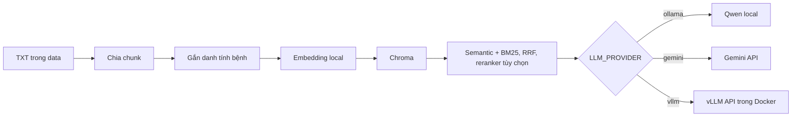

# RAG bệnh cây với LangChain

Module này đọc tài liệu `.txt`, tạo embedding tiếng Việt trên máy, lưu vector
trong Chroma và dùng LLM để sinh câu trả lời có trích nguồn. LLM mặc định là
`qwen3.5:4b` chạy local qua Ollama; có thể chuyển sang Gemini hoặc vLLM chạy
trong Docker bằng `LLM_PROVIDER` trong `.env`.

## Luồng xử lý



- `index`: đọc `data/**/*.txt`, chia chunk và build lại index theo strategy.
- `preview-chunks`: xem chunk, heading, token và vị trí nguồn trước khi index.
- `search`: kiểm tra các chunk được truy xuất, không gọi LLM.
- `ask`: retrieve context rồi gọi provider được chọn trong `.env`.
- `chat`: nhận nhiều câu hỏi trong cùng process, giữ model và Chroma để dùng lại.

Retrieval mặc định kết hợp semantic search và BM25 bằng RRF. Query luôn tìm trên
toàn collection; alias không còn tạo bộ lọc cứng theo bệnh. Có thể bật reranker
để xếp hạng lại ứng viên. Chi tiết và hướng dẫn debug: [docs/RETRIEVAL.md](docs/RETRIEVAL.md).

## Chọn chunking cũ hoặc theo cấu trúc

Trong `.env`:

```dotenv
CHUNKING_STRATEGY=recursive
CHUNK_MAX_TOKENS=400
CHUNK_OVERLAP_TOKENS=40
CHUNK_TOKENIZER_MODEL=
CHROMA_DIR=
```

Đổi `CHUNKING_STRATEGY=structure` để dùng heading và giới hạn token. Khi
`CHROMA_DIR` để trống, `recursive` dùng `chroma_db/`, `structure` dùng
`chroma_db_structure/`; `search`, `ask`, `chat` tự chọn thư mục tương ứng.
Sau khi đổi config, khởi động lại chương trình. Tạo mỗi index một lần:

```powershell
python main.py preview-chunks --strategy structure --source apple/apple_black_rot.txt
python main.py index --strategy recursive
python main.py index --strategy structure
```

Đổi strategy không chia lại các chunk đã lưu. Sửa data hoặc budget thì chạy
`index` lại. Có thể dùng `--index-dir` trên cả bốn lệnh để chọn index cụ thể.
Hướng dẫn A/B, snapshot trước sửa, benchmark 60 câu và cách đọc code:
[docs/CHUNKING.md](docs/CHUNKING.md).

## Hỏi liên tục để tránh nạp lại model

Chạy trong `RAG-module` với `.venv` đã activate:

```powershell
python main.py chat
```

Chờ dòng `Chuẩn bị xong`, nhập từng câu hỏi. Gõ `/exit` hoặc nhấn `Ctrl+C` để
thoát. Embedding và reranker (nếu bật) được giữ trong RAM/VRAM suốt phiên.
Chroma và LLM client cũng được dùng lại. `chat` giữ lịch sử theo phiên để làm rõ
những câu nối tiếp như “bệnh đó thì sao?”. Gõ `/reset` để bắt đầu hội thoại mới
mà không nạp lại model. Lịch sử chỉ nằm trong RAM và mất khi thoát chương trình.

### Test hội thoại với Ollama Qwen3.5 4B

```dotenv
LLM_PROVIDER=ollama
OLLAMA_MODEL=qwen3.5:4b
OLLAMA_THINK=false
CHAT_HISTORY_TURNS=4
CHAT_HISTORY_MAX_CHARS=6000
```

```powershell
python main.py chat --debug
```

Thử hỏi lần lượt `Bệnh ghẻ táo có triệu chứng gì?`, `Vậy tác nhân gây bệnh đó
là gì?`, rồi đổi chủ đề sang `Cháy lá sớm trên khoai tây do tác nhân nào?`.
Debug hiện `retrieval_query` để xem LLM đã hiểu câu nối tiếp thành câu nào.
Mỗi lượt khi có lịch sử thêm một lần gọi LLM để rewrite, dùng cùng model/client
đang chạy. `--history-turns 0` tắt memory để so sánh độ trễ.

Chi tiết cách đọc code và giới hạn: [docs/CHAT_MEMORY.md](docs/CHAT_MEMORY.md).

Thử nhiều query retrieval trong cùng phiên:

```powershell
python main.py chat --search-only --mode hybrid --no-rerank --debug
python main.py chat --search-only --mode bm25 --no-rerank
```

`chat` in riêng thời gian chuẩn bị và thời gian mỗi query. `--search-only` tìm
kiếm độc lập, không dùng/thay đổi lịch sử hoặc gọi LLM. Lệnh `ask`/`search` một lần vẫn khởi động process mới
và nạp lại model local; cache file trên ổ đĩa không giữ model trong RAM.

Đổi `.env` hoặc rebuild index thì thoát và mở lại phiên. LLM chạy ở Ollama/vLLM
server có vòng đời bộ nhớ riêng; xem [docs/MODEL_LIFECYCLE.md](docs/MODEL_LIFECYCLE.md)
để cấu hình Ollama giữ model lâu hơn và dùng `RAGSession` trực tiếp trong Python.

## Chọn và debug retrieval

```dotenv
RETRIEVAL_MODE=hybrid
RETRIEVAL_CANDIDATE_K=20
RETRIEVAL_RRF_K=60
RERANKER_ENABLED=false
RERANKER_MODEL=cross-encoder/mmarco-mMiniLMv2-L12-H384-v1
RERANKER_DEVICE=cpu
```

`RETRIEVAL_MODE` nhận `semantic`, `bm25` hoặc `hybrid`, độc lập với
`LLM_PROVIDER=ollama|gemini|vllm`. Sau khi sửa `.env`, chạy lại chương trình.
CLI cũng cho ghi đè mode/reranker cho từng lần chạy:

```powershell
python main.py search "Bệnh cháy lá sớm trên khoai tây?" --mode bm25 --no-rerank --debug
python main.py search "Bệnh cháy lá sớm trên khoai tây?" --mode hybrid --no-rerank --debug
python main.py search "Bệnh cháy lá sớm trên khoai tây?" --mode hybrid --rerank --debug
python main.py ask "Bệnh ghẻ táo có triệu chứng gì?" --mode hybrid
```

BM25 đọc chunk từ Chroma nên dùng tiếp được index hiện có và không tải embedding.
`--rerank` tải model reranker ở lần đầu, có thể cần Internet; mặc định tắt.
Đổi mode/reranker không cần tạo lại index. Sửa corpus hoặc embedding vẫn cần
`python main.py index`. Các điểm debug là điểm xếp hạng, không phải xác suất
câu trả lời đúng.

Kế hoạch và kết quả triển khai: [agents/hybrid-retrieval-plan.md](agents/hybrid-retrieval-plan.md).

## 1. Cài Ollama trên Windows

Cài bằng `winget`:

```powershell
winget install --exact --id Ollama.Ollama
```

Hoặc tải trình cài đặt từ [ollama.com/download/windows](https://ollama.com/download/windows).
Sau khi cài, mở terminal PowerShell mới rồi kiểm tra:

```powershell
ollama --version
```

Ứng dụng Ollama trên Windows thường tự chạy server nền. Nếu
`http://127.0.0.1:11434` chưa hoạt động, mở ứng dụng Ollama hoặc chạy:

```powershell
ollama serve
```

Giữ terminal này mở nếu bạn chạy `ollama serve` thủ công.

## 2. Tải và thử model local

Model mặc định, phù hợp với luồng RAG tiếng Việt:

```powershell
ollama pull qwen3.5:4b
ollama run qwen3.5:4b
```

Nhập một câu hỏi để kiểm tra. Gõ `/bye` để thoát phiên chat. Có thể xem model
đã tải và model đang nằm trong bộ nhớ bằng:

```powershell
ollama list
ollama ps
```

Cấu hình thử nghiệm dùng model 4B với context 8192 token. Dùng `ollama ps` để
kiểm tra model đang chạy trên CPU/GPU; mức dùng bộ nhớ còn phụ thuộc context
và model embedding/reranker chạy cùng lúc. Thông tin model:
[Ollama qwen3.5:4b](https://ollama.com/library/qwen3.5:4b).

## 3. Tạo môi trường Python

Yêu cầu Python 3.11. Từ thư mục gốc repository:

```powershell
Set-Location RAG-module
py -3.11 -m venv .venv
.\.venv\Scripts\Activate.ps1
python -m pip install --upgrade pip
python -m pip install -r requirements.txt
```

Nếu PowerShell chặn script activate, chỉ áp dụng cho terminal hiện tại:

```powershell
Set-ExecutionPolicy -Scope Process -ExecutionPolicy Bypass
.\.venv\Scripts\Activate.ps1
```

Tạo `.env` nếu file chưa tồn tại:

```powershell
if (-not (Test-Path .env)) { Copy-Item .env.example .env }
```

## 4. Cấu hình Ollama

Nội dung cần có trong `.env`:

```dotenv
LLM_PROVIDER=ollama

OLLAMA_MODEL=qwen3.5:4b
OLLAMA_BASE_URL=http://127.0.0.1:11434
OLLAMA_NUM_CTX=8192
OLLAMA_NUM_PREDICT=800
OLLAMA_KEEP_ALIVE=10m
OLLAMA_THINK=false

EMBEDDING_MODEL=AITeamVN/Vietnamese_Embedding
EMBEDDING_DEVICE=cpu
```

Ý nghĩa các biến Ollama:

| Biến | Mặc định | Mục đích |
| --- | --- | --- |
| `OLLAMA_MODEL` | `qwen3.5:4b` | Tên model đã tải bằng `ollama pull` |
| `OLLAMA_BASE_URL` | `http://127.0.0.1:11434` | Địa chỉ Ollama server |
| `OLLAMA_NUM_CTX` | `8192` | Số token context tối đa |
| `OLLAMA_NUM_PREDICT` | `800` | Số token đầu ra tối đa |
| `OLLAMA_KEEP_ALIVE` | `10m` | Thời gian giữ model trong bộ nhớ sau request |
| `OLLAMA_THINK` | `false` | Bật/tắt reasoning; nên tắt cho RAG thông thường |

Embedding để ở CPU nhằm dành VRAM cho LLM. Lần chạy `index` đầu tiên sẽ tải
`AITeamVN/Vietnamese_Embedding`, nên cần Internet và có thể mất vài phút.

## 5. Chạy RAG

Vẫn ở thư mục `RAG-module` và đã activate `.venv`:

```powershell
python main.py index
python main.py search "Bệnh ghẻ táo có triệu chứng gì?"
python main.py ask "Cách quản lý bệnh thối đen trên táo?"
```

Thay đổi số chunk truy xuất:

```powershell
python main.py search "So sánh bệnh ghẻ và thối đen trên táo" --top-k 6
python main.py ask "So sánh bệnh ghẻ và thối đen trên táo" --top-k 6
```

Các lệnh chính:

| Lệnh | Tác dụng | Cần LLM provider đã chọn |
| --- | --- | --- |
| `python main.py index` | Build lại index từ `data/**/*.txt` | Không |
| `python main.py search "<câu hỏi>"` | In các chunk gần nhất | Không |
| `python main.py ask "<câu hỏi>"` | Sinh câu trả lời và in nguồn | Có |
| `python main.py chat` | Hỏi liên tục, giữ tài nguyên của phiên | Có |
| `python main.py chat --search-only` | Retrieval liên tục, giữ model local | Không |

Chạy lại `index` khi thêm/sửa tài liệu hoặc đổi embedding model. Đổi LLM,
context, prompt hay provider không yêu cầu build lại index.

## Chuyển giữa Ollama, Gemini và vLLM

Thiết lập model/endpoint/API key của từng provider một lần, sau đó chỉ đổi
`LLM_PROVIDER` trong `.env`:

| Giá trị | Provider | Cấu hình chính |
| --- | --- | --- |
| `ollama` | Ollama | `OLLAMA_MODEL`, `OLLAMA_BASE_URL` |
| `gemini` | Gemini API | `GEMINI_MODEL`, `GEMINI_API_KEY` |
| `vllm` | API vLLM trong Docker | `VLLM_MODEL`, `VLLM_BASE_URL`, `VLLM_API_KEY` nếu có |

Chạy lại `python main.py ask "..."` sau khi sửa `.env`. Với process Python chạy
liên tục hoặc notebook, khởi động lại process/kernel để đọc cấu hình mới.
Biến môi trường của terminal được ưu tiên hơn `.env`; nếu đã đặt
`$env:LLM_PROVIDER`, hãy bỏ biến đó khi muốn chọn provider từ file.
Chương trình gọi đúng provider được chọn, không tự chuyển sang provider khác
khi gặp lỗi. Không cần sửa `rag.py` hay tạo lại Chroma index.

## Dùng Gemini thay Ollama

Đổi `.env` thành:

```dotenv
LLM_PROVIDER=gemini
GEMINI_API_KEY=your_gemini_api_key
GEMINI_MODEL=gemini-2.5-flash
```

`index` và `search` vẫn hoàn toàn local. Khi dùng Gemini, chỉ câu hỏi và các
chunk đã retrieve được gửi tới API; toàn bộ corpus không được gửi đi.

## Dùng vLLM trong Docker

RAG có thể chạy trong môi trường Python trên Windows và gọi vLLM qua HTTP.
Chỉ cài `langchain-openai` ở phía RAG (đã có trong `requirements.txt`), không
cần cài package `vllm` vào `.venv` Windows:

```powershell
python -m pip install -r requirements.txt
```

Container cần publish cổng `8000` (ví dụ `-p 8000:8000`) và vLLM bên trong
lắng nghe ở `0.0.0.0:8000`. Khi container đang chạy, kiểm tra từ PowerShell:

```powershell
curl.exe http://127.0.0.1:8000/v1/models
```

Điền `id` model trong kết quả vào `VLLM_MODEL`. Ví dụ với model trong
`../test-vllm.txt`:

```dotenv
LLM_PROVIDER=vllm
VLLM_BASE_URL=http://127.0.0.1:8000/v1
VLLM_MODEL=Qwen/Qwen3-0.6B
VLLM_API_KEY=
VLLM_MAX_TOKENS=800
VLLM_TIMEOUT=120
VLLM_THINK=false

EMBEDDING_MODEL=AITeamVN/Vietnamese_Embedding
EMBEDDING_DEVICE=cpu
```

- `VLLM_BASE_URL` là địa chỉ gốc API, có `/v1`; không thêm `/chat/completions`.
- `VLLM_MODEL` là tên phục vụ qua API (kể cả alias `--served-model-name`),
  không phải tên model trong Ollama.
- `VLLM_API_KEY`: để trống nếu server không bật xác thực. Nếu container dùng
  `--api-key`, điền đúng key và dùng key đó khi kiểm tra `/v1/models`.
- `VLLM_MAX_TOKENS`: giới hạn token đầu ra; `VLLM_TIMEOUT`: timeout tính bằng giây.
  Cả hai phải là số nguyên lớn hơn 0.
- `VLLM_THINK=false` gửi `chat_template_kwargs.enable_thinking=false` cho
  chat template hỗ trợ như Qwen3. Để trống để dùng mặc định của server/model.
  Khi bật thinking, cần cấu hình reasoning parser phù hợp ở vLLM nếu muốn
  tách reasoning khỏi câu trả lời.
- Context tối đa và bộ nhớ GPU được cấu hình khi chạy container, ví dụ
  `--max-model-len`; các biến `OLLAMA_*` không điều khiển vLLM.
- Nếu RAG chạy trong container khác cùng Docker network, dùng tên service,
  ví dụ `VLLM_BASE_URL=http://vllm:8000/v1`.

Sau đó chạy cùng CLI hiện tại:

```powershell
python main.py search "Bệnh ghẻ táo có triệu chứng gì?"
python main.py ask "Bệnh ghẻ táo có triệu chứng gì?"
```

Nếu kết nối thất bại, kiểm tra trạng thái container, cổng publish và URL. Nếu
API báo không tìm thấy model, đối chiếu `VLLM_MODEL` với `/v1/models`.

Tham khảo: [LangChain vLLM](https://docs.langchain.com/oss/python/integrations/chat/vllm),
[Qwen3 với vLLM](https://github.com/QwenLM/Qwen3/blob/main/docs/source/deployment/vllm.md).

## Chạy test

Test dùng provider giả và HTTP mock, không gọi server Ollama/vLLM, Gemini
hay tải embedding model thật:

```powershell
python -m pytest -q
```

## Xử lý lỗi thường gặp

### Không nhận lệnh `ollama`

Mở PowerShell mới sau khi cài. Nếu vẫn lỗi, mở ứng dụng Ollama từ Start Menu
và kiểm tra lại `ollama --version`.

### Không kết nối được `127.0.0.1:11434`

Ollama server chưa chạy. Mở ứng dụng Ollama hoặc chạy `ollama serve` trong một
terminal khác, sau đó thử:

```powershell
ollama list
```

### Báo không tìm thấy model

Tên trong `.env` phải trùng với kết quả `ollama list`:

```powershell
ollama pull qwen3.5:4b
ollama list
```

### Chậm, tràn VRAM hoặc chạy một phần trên CPU

Giảm context trước:

```dotenv
OLLAMA_NUM_CTX=4096
```

Nếu vẫn thiếu bộ nhớ, chuyển sang `qwen3.5:4b`. Không nên chạy đồng thời
model-service YOLO của `detection-module` và Qwen 9B trên GPU 8 GB. Dùng
`ollama ps` để xem model đang chạy trên GPU hay CPU.

### Câu trả lời hết giữa chừng

Tăng `OLLAMA_NUM_PREDICT`, ví dụ `1200`. Giá trị lớn hơn làm thời gian sinh câu
trả lời lâu hơn và có thể tăng mức dùng bộ nhớ.

### Muốn thử DeepSeek reasoning

```powershell
ollama pull deepseek-r1:8b
```

Sau đó cấu hình:

```dotenv
OLLAMA_MODEL=deepseek-r1:8b
OLLAMA_THINK=true
```

Model reasoning thường chậm hơn. Với hỏi đáp dựa trên context, nên bắt đầu bằng
Qwen và `OLLAMA_THINK=false`.

## Dùng trực tiếp từ Python

```python
from rag import ask, build_index, retrieve

document_count, chunk_count = build_index()
print(f"Đã index {document_count} tài liệu thành {chunk_count} chunk")

chunks = retrieve("Dấu hiệu bệnh ghẻ táo là gì?")
for chunk in chunks:
    print(chunk.metadata["source"], chunk.metadata["disease"])

answer, sources = ask("Cách quản lý bệnh thối đen trên táo?")
print(answer)
print(sources)
```

## Cấu trúc chính

```text
RAG-module/
|-- config.py          # Embedding và factory Ollama/Gemini/vLLM
|-- rag.py             # Pipeline index, retrieve, ask và RAGSession dùng lại tài nguyên
|-- retrieval.py       # Semantic, BM25, RRF, rerank, debug
|-- conversation.py    # Lịch sử giới hạn theo phiên và query rewrite
|-- main.py            # CLI
|-- data/              # Corpus TXT
|-- chroma_db/         # Vector database được sinh local
|-- docs/              # Tài liệu kỹ thuật chi tiết
|-- tests/             # Test offline
|-- .env.example
`-- requirements.txt
```
