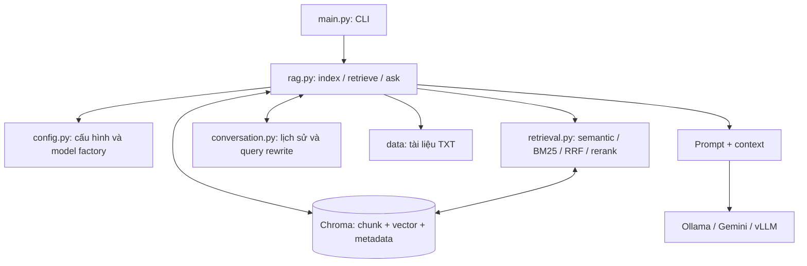

# Kiến trúc hệ thống

[← README](../README.md) · [Pipeline](PIPELINE.md) · [Retrieval và debug](RETRIEVAL.md)

## Luồng chính

## Trách nhiệm

| File | Trách nhiệm |
| --- | --- |
| `config.py` | Cấu hình retrieval và chọn provider/model |
| `rag.py` | Đọc TXT, chia chunk, build index, API retrieve/ask, RAGSession và citation |
| `retrieval.py` | Các thuật toán tìm kiếm và trace để debug |
| `conversation.py` | Lịch sử có giới hạn riêng từng phiên và viết lại query nối tiếp |
| `main.py` | CLI, override config và trình bày kết quả |

`retrieval.py` không gọi LLM sinh câu trả lời và không import `rag.py`.
Alias mô tả tài liệu; query không tạo bộ lọc cứng disease_id.

## Dữ liệu và model

Chroma giữ text, identity header, metadata và embedding. Semantic search và
BM25 cùng dùng corpus này. BM25 đọc text trực tiếp, không tải embedding.
Reranker tùy chọn chạy local, chỉ tải khi bật.

Khi `ask`, provider được chọn nhận prompt, câu hỏi và top-k chunk. Với
Ollama/vLLM, endpoint quyết định server chạy trên máy nào. Với Gemini, context
được gửi tới API. Index/retrieval không gọi API LLM sinh câu trả lời.

Trong `chat` hỏi đáp, `RAGSession` giữ model/client và memory trong RAM. Khi có
lịch sử, cùng LLM viết lại query trước retrieval, rồi nhận câu hỏi gốc, query
đã làm rõ, lịch sử và chunk mới để trả lời. `/reset` xóa memory nhưng giữ model.
Memory không dùng chung giữa các session, không lưu xuống đĩa.

## Khi nào cần index lại?

- Thay tài liệu, cách chia chunk, identity header hoặc embedding: index lại.
- Đổi provider, mode retrieval, candidate-k hoặc reranker: dùng tiếp index hiện
  có. BM25 không có index riêng cần đồng bộ.

## Giới hạn

Hiện chưa có lưu/khôi phục history qua lần khởi động, GraphRAG, OCR, chunking theo mục hoặc kiểm tra
citation tự động. Xem [RETRIEVAL.md](RETRIEVAL.md) để đọc source, debug và đánh
giá chất lượng, [CHAT_MEMORY.md](CHAT_MEMORY.md) cho hội thoại. Nếu nối FastAPI,
gọi API public của `rag.py` và tạo một session riêng cho mỗi cuộc hội thoại.
