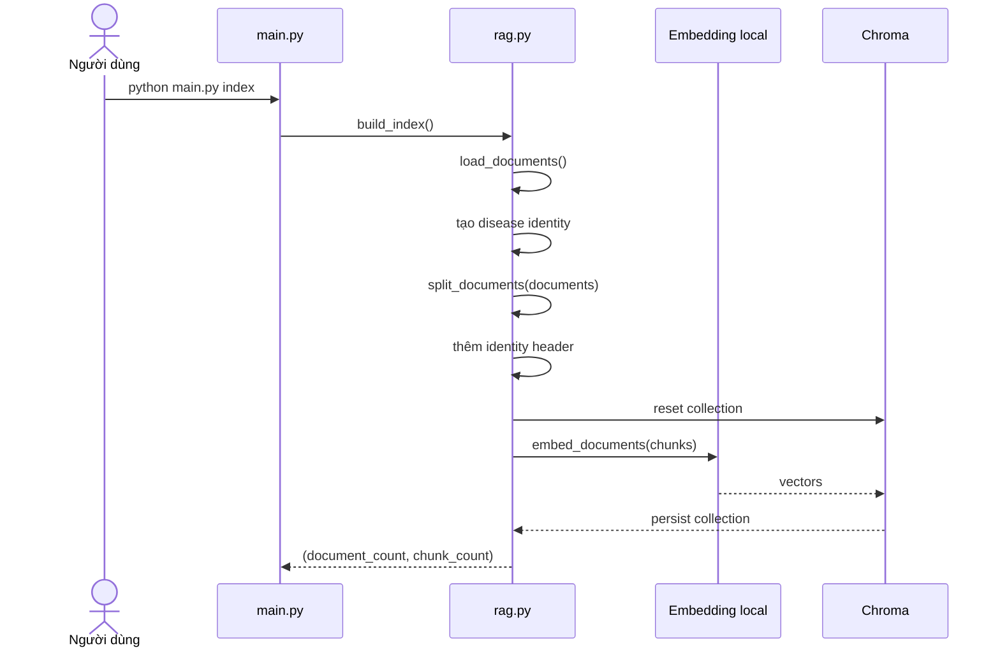
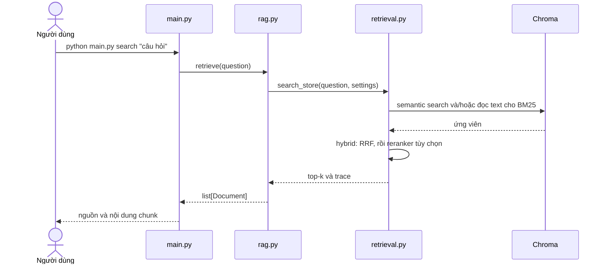
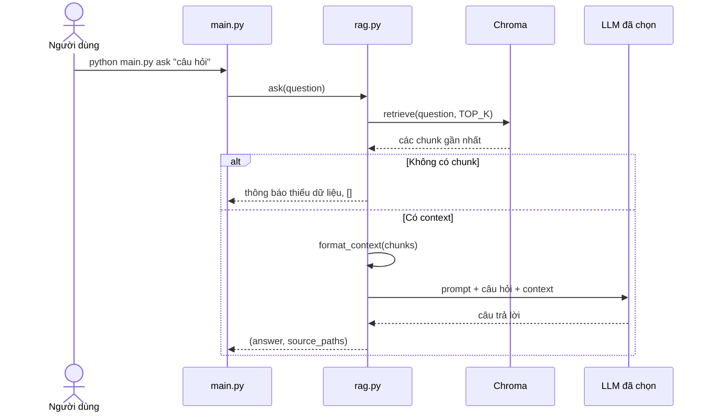

# Pipeline kỹ thuật

[← README](../README.md) · [Kiến trúc](ARCHITECTURE.md) · [Workflow](WORKFLOW.md)

## 1. Pipeline tạo index

```text
data/**/*.txt
    → load UTF-8 thành Document
    → tạo disease identity và metadata
    → chọn recursive hoặc structure qua CHUNKING_STRATEGY
    → chia và thêm header tương ứng
    → tạo vector bằng AITeamVN/Vietnamese_Embedding
    → lưu chunk + vector + metadata vào Chroma
```

`python main.py index` build lại collection trong index được chọn. Hai strategy
dùng hai thư mục mặc định; manifest lưu cấu hình và fingerprint corpus để kiểm
tra snapshot. Chi tiết: [CHUNKING.md](CHUNKING.md).



Các bước chính:

1. Tìm đệ quy mọi file `.txt` bên dưới `data/`.
2. Đọc từng file bằng UTF-8 và bỏ qua file rỗng.
3. Tạo một `Document` cùng metadata nguồn và danh tính bệnh.
4. Recursive chia theo 1000 ký tự/overlap 150. Structure parse heading, giữ unit
   vừa budget; unit dài chia tiếp theo token, overlap trong cùng unit.
5. Recursive thêm identity header cũ. Structure dùng compact header có heading
   và kiểm tra token của cả header + body sau render.
6. Ghi manifest `building`, reset đúng collection, embed/lưu chunk rồi đánh dấu
   manifest `ready`. Query từ chối index đang build dở.

Nếu thay đổi tài liệu, chunk size, overlap hoặc embedding model, phải chạy lại lệnh `index`.

Thay đổi identity header/metadata cần build lại để có hiệu lực. Index cũ vẫn có
thể được đọc để so sánh baseline; đổi config không tự biến đổi snapshot đã lưu.

Để giữ source đơn giản, collection cũ được reset trước khi ghi các chunk mới. Nếu
model hết bộ nhớ hoặc quá trình ghi index thất bại giữa chừng, collection có thể
rỗng; sửa nguyên nhân rồi chạy lại `python main.py index`.

## 2. Pipeline `search`

`search` dùng để quan sát retrieval mà không gọi LLM sinh câu trả lời:



`retrieve()` trả Document; `retrieve_with_debug()` trả cả trace. CLI `search --debug` in trace rồi in top-k. BM25 tìm trên snapshot text trong Chroma, không đọc lại `data/` khi query.

- `semantic`: tìm bằng embedding.
- `bm25`: tìm từ khóa, không tải embedding.
- `hybrid`: gộp hai nhánh bằng RRF.

Không nhận diện alias để tạo metadata filter. Mọi mode tìm toàn corpus; có thể bật reranker để xếp hạng lại tập ứng viên có giới hạn.

Xem [RETRIEVAL.md](RETRIEVAL.md) cho tokenizer, công thức RRF, reranker và ý nghĩa điểm debug.

## 3. Pipeline `ask`



Mỗi chunk trong prompt có nhãn rõ ràng:

```text
[Nguồn 1: apple/apple_scab.txt]
Tài liệu: Apple Scab
Bệnh: Bệnh ghẻ táo
Tên gọi: bệnh ghẻ táo | apple scab | bệnh sẹo táo
<nội dung chunk>
```

Prompt yêu cầu LLM:

- Chỉ trả lời bằng context được cung cấp.
- Nói rõ khi context chưa đủ.
- Không tự tạo hoạt chất, liều lượng hoặc khuyến nghị hóa chất.
- Trả lời theo ngôn ngữ câu hỏi; mặc định dùng tiếng Việt.
- Dẫn nhãn `[Nguồn n]` cho thông tin đã sử dụng.

`ask()` đồng thời trả một danh sách đường dẫn nguồn lấy trực tiếp từ metadata. Danh sách này phản ánh retrieval thực tế và không phụ thuộc việc LLM có viết citation đúng hay không.

## Identity header và metadata

Mỗi tài liệu giữ metadata nguồn và danh tính bệnh; splitter bổ sung `start_index` cho từng chunk:

| Trường | Ví dụ | Mục đích |
|---|---|---|
| `source` | `apple/apple_scab.txt` | Citation và truy vết về file gốc |
| `crop` | `apple` | Nhận biết nhóm cây trồng |
| `title` | `Apple Scab` | Tên dễ đọc suy ra từ filename |
| `disease` | `Bệnh ghẻ táo` | Tên bệnh chuẩn để hiển thị |
| `disease_id` | `apple-ghe-tao` | ID mô tả và truy vết bệnh của tài liệu |
| `disease_aliases` | `bệnh ghẻ táo \| apple scab \| bệnh sẹo táo` | Tên chuẩn/tên gọi khác trong identity header để tìm kiếm |
| `start_index` | `0`, `850`, ... | Vị trí ký tự bắt đầu của chunk trong tài liệu gốc |

`disease_aliases` dùng ` | ` làm dấu phân cách nội bộ; một alias không được chứa ký tự `|`. Splitter sao chép metadata từ `Document` gốc sang từng chunk rồi pipeline thêm identity header vào `page_content` trước khi embedding. Vì header được thêm sau bước chia, `page_content` lưu trong Chroma có thể dài hơn `CHUNK_SIZE`; `start_index` vẫn chỉ vị trí của nội dung gốc trong file.

`ask()` dùng đúng các chunk đã qua identity header làm context. Luồng retrieval của `ask` giống `search` vì cùng dùng API trong `rag.py`.

Dense search chưa có relevance threshold đã được hiệu chỉnh. Với collection không
rỗng, một câu ngoài corpus vẫn có thể nhận các chunk "gần nhất"; prompt chịu trách
nhiệm nói rằng context chưa đủ. Đây là giới hạn có chủ đích của baseline V1.

## Luồng lỗi

| Tình huống | Dừng ở đâu | Cách xử lý |
|---|---|---|
| Không có TXT hợp lệ | `load_documents()` | Thêm file vào `data/<crop>/` rồi chạy lại `index` |
| File không phải UTF-8 | `load_documents()` | Lỗi nêu đúng file; lưu lại file bằng UTF-8 |
| Chưa có index | `retrieve()` / `ask()` | Chạy `python main.py index` |
| Câu hỏi rỗng | `retrieve()` / `ask()` | Nhập câu hỏi có nội dung |
| Retrieval không có chunk | `ask()` | Trả thông báo thiếu dữ liệu, không gọi Gemini |
| Thiếu `GEMINI_API_KEY` | `ask()` với provider Gemini | Điền key trong `.env`; `index` và `search` vẫn dùng được |
| Gemini hết quota/API lỗi | Bước sinh câu trả lời | Hiển thị lỗi thật; không tạo câu trả lời giả |

Để xử lý sự cố theo thứ tự ít tốn chi phí nhất, xem [WORKFLOW.md](WORKFLOW.md).
